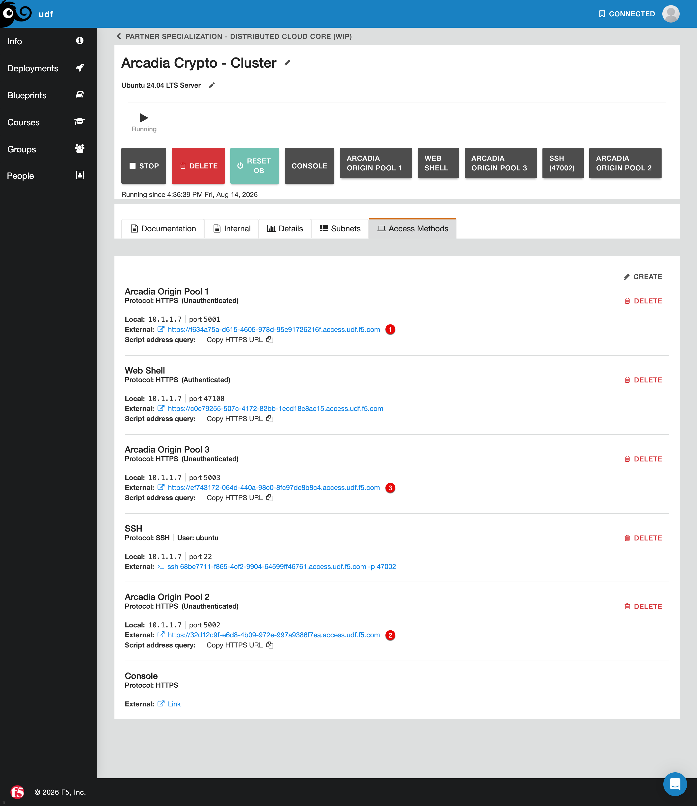
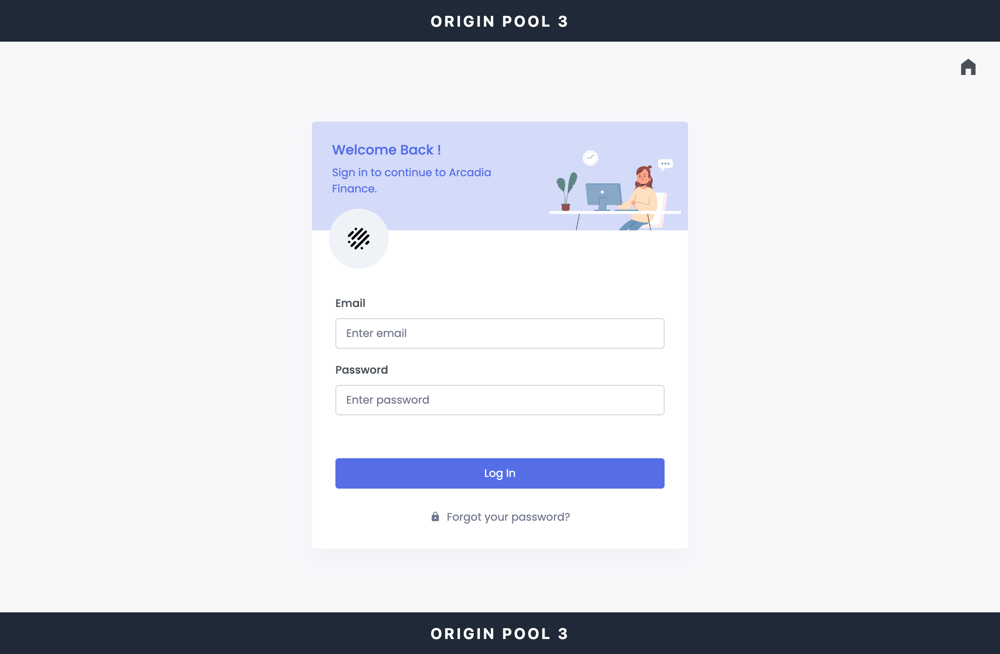
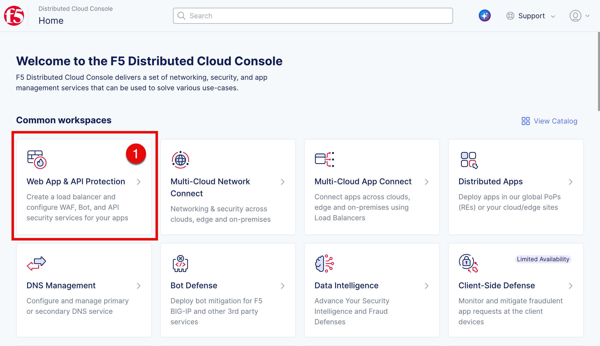
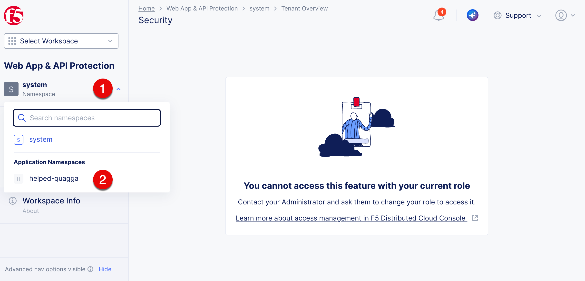
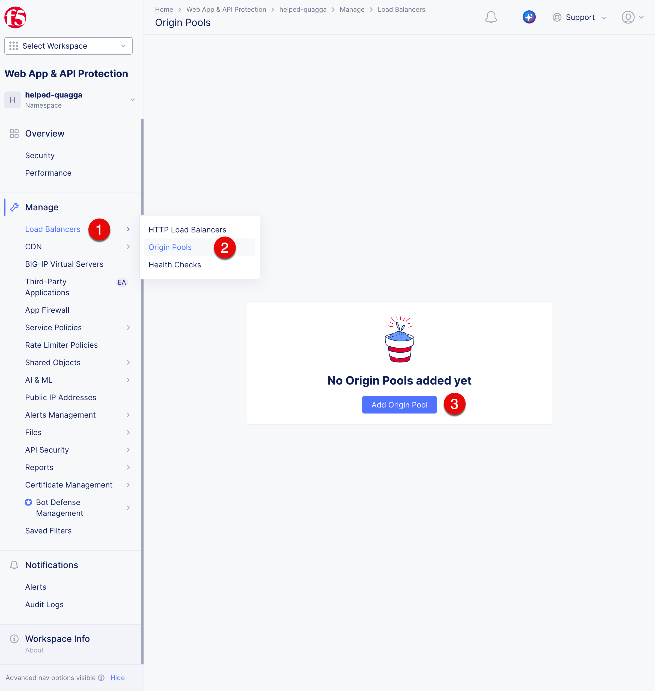
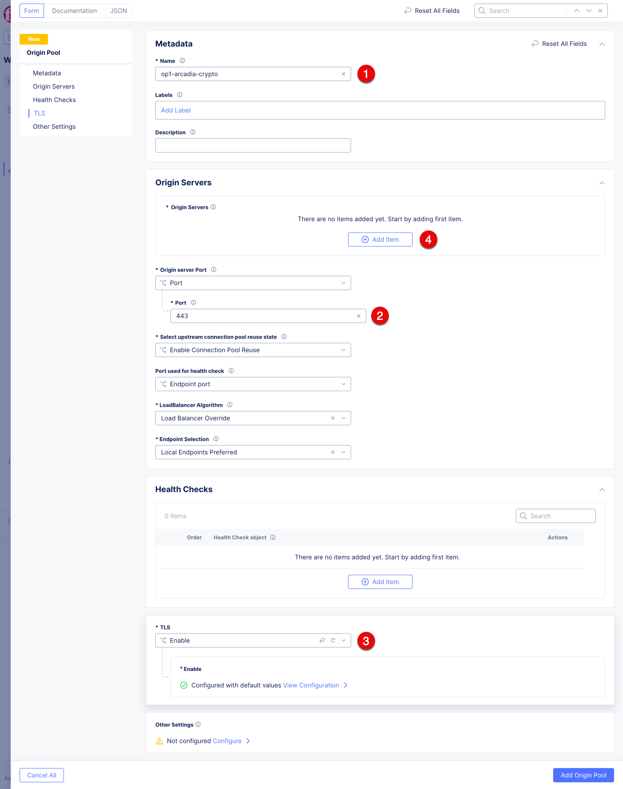
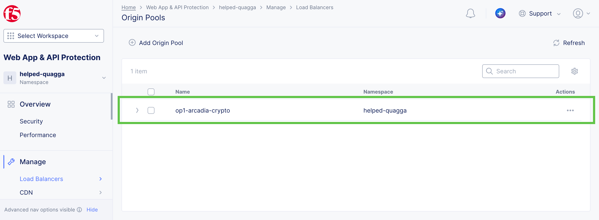

Create the Arcadia Origin Pool
######################################

In this exercise, you will identify the three Arcadia Crypto application endpoints provided by UDF and add all three endpoints as origin servers in one F5 Distributed Cloud origin pool.

Discover the Arcadia Crypto endpoints
=====================================

1. In UDF, locate the component named **Arcadia Crypto - Cluster**.

2. Open the **Details** menu for the component. Under **Access Methods**, locate these three URLs:

   .. react:: DeploymentAccessMethods
      :deployment: Arcadia Crypto - Cluster
      :access-methods: Arcadia Origin Pool 1, Arcadia Origin Pool 2, Arcadia Origin Pool 3

3. Record each URL. You will use all three hostnames when you configure the origin servers.

Verify the Arcadia Crypto endpoints
===================================

1. Open :deployment-access-method:`Arcadia Crypto - Cluster|Arcadia Origin Pool 1` in a new browser tab.

2. Confirm that **Origin Pool 1** appears in the page header and footer.

.. image:: ../pictures/arcadia-crypto-op1.png
   :align: center

3. Open :deployment-access-method:`Arcadia Crypto - Cluster|Arcadia Origin Pool 2` and confirm that **Origin Pool 2** appears in the header and footer.

4. Open :deployment-access-method:`Arcadia Crypto - Cluster|Arcadia Origin Pool 3` and confirm that **Origin Pool 3** appears in the header and footer.

Create an origin pool with three origin servers
================================================

An origin pool in F5 Distributed Cloud (XC) is a logical group of backend servers, called origins, that host an application or service. An HTTP load balancer sends client requests to an origin pool instead of connecting directly to a specific backend. This separation allows the backend destinations to change without requiring changes to the application's public endpoint.

An origin pool defines the backend server addresses, service port, TLS configuration, load-balancing algorithm, and health checks used by XC. For a pool with multiple origins, XC applies the configured algorithm across origins that pass their health checks. An origin that fails a health check is removed from traffic distribution until it meets the configured health criteria again.

In this lab, all three Arcadia Crypto endpoints are added to one origin pool as separate origin servers. In the next exercise, you will attach this origin pool to an HTTP load balancer.

1. On the F5 Distributed Cloud Console home page, select the **Web App & API Protection** tile.

2. Select **Namespaces (1)**, and then select your namespace (2): ``$$namespace$$``.

3. Click **Load Balancers (1)** -> **Origin Pools (2)**, and then click **Add Origin Pool (3)**.

4. On the **Origin Pool** configuration page, fill in the following fields:

   * **Name (1):** op1-arcadia-crypto
   * **Port (2):** 443
   * **TLS (3):** Enable

5. Under **Origin Servers**, click **Add Item (4)**.

6. Configure the first origin server with the values below. For **DNS Name**, enter only the hostname from the first UDF URL; do not include ``https://`` or a path.

   .. table::
      :widths: auto

      ==============================    =========================================================
      Object                            Value
      ==============================    =========================================================
      **Origin Server Type (1)**        Public NS Name or Origin Server
      **DNS Name (2)**                  :deployment-access-method-url:`Arcadia Crypto - Cluster|Arcadia Origin Pool 1`
      ==============================    =========================================================

7. Click **Apply (3)** to add the origin server.
   .. image:: ../pictures/op-details-2.png
      :align: center

8. The added origin server will look like this:
   .. image:: ../pictures/op-os-res-1.png
      :align: center

9. Repeat steps 5 through 7 for the other two UDF URLs:

   .. table::
      :widths: auto

      =========================    ==========================================================================================
      Origin pool                  Hostname source
      =========================    ==========================================================================================
      **Arcadia Origin Pool 2**    :deployment-access-method-url:`Arcadia Crypto - Cluster|Arcadia Origin Pool 2`
      **Arcadia Origin Pool 3**    :deployment-access-method-url:`Arcadia Crypto - Cluster|Arcadia Origin Pool 3`
      =========================    ==========================================================================================

10. Confirm that the origin pool contains three origin servers, and then click **Add Origin Pool (1)**.
    .. image:: ../pictures/op-os-res-2.png
       :align: center

.. note:: The **Health Checks** field is not configured in this exercise. Consequently, XC does not perform an active health probe against the three origin servers. For production deployments, associate an HTTP, HTTPS, or TCP health check with the origin pool and configure its interval, timeout, and healthy and unhealthy thresholds for the application.

Origin Pool Create Result
=========================

After you click **Add Origin Pool**, the new origin pool appears in the list of origin pools. The origin pool is named ``op1-arcadia-crypto`` and contains three origin servers.

