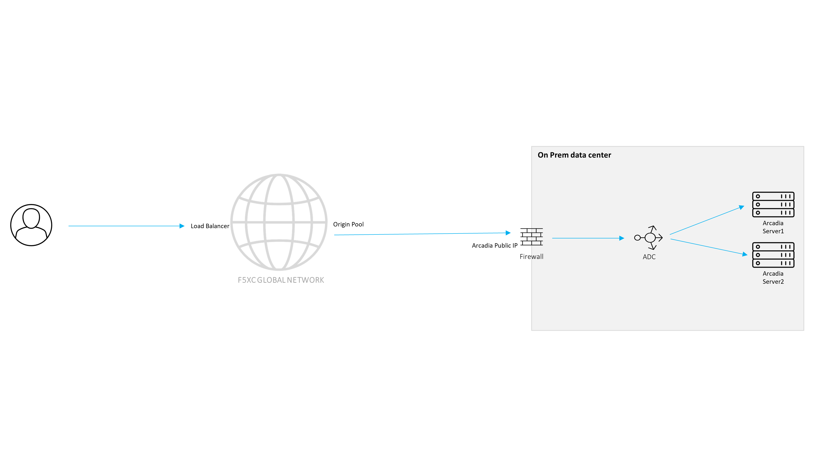

Publish the application
#######################

In this section, you will publish an existing internet-facing Arcadia Crypto application (**Arcadia Crypto - Cluster** component) through the F5 Distributed Cloud Services (F5 XC) Global Network. You will create one origin pool with three origin servers, attach it to an HTTP load balancer, and verify round-robin traffic distribution by observing the origin server name in the application's header and footer.

The application domain for these exercises is ``$$namespace$$.spec-core.f5se.com``.

 
**Hands-on exercises**

.. toctree::
   :maxdepth: 1
   :glob:

   [0-9][0-9]-*/[0-9][0-9]-*

