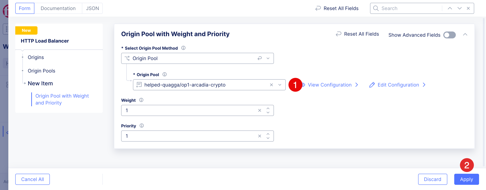
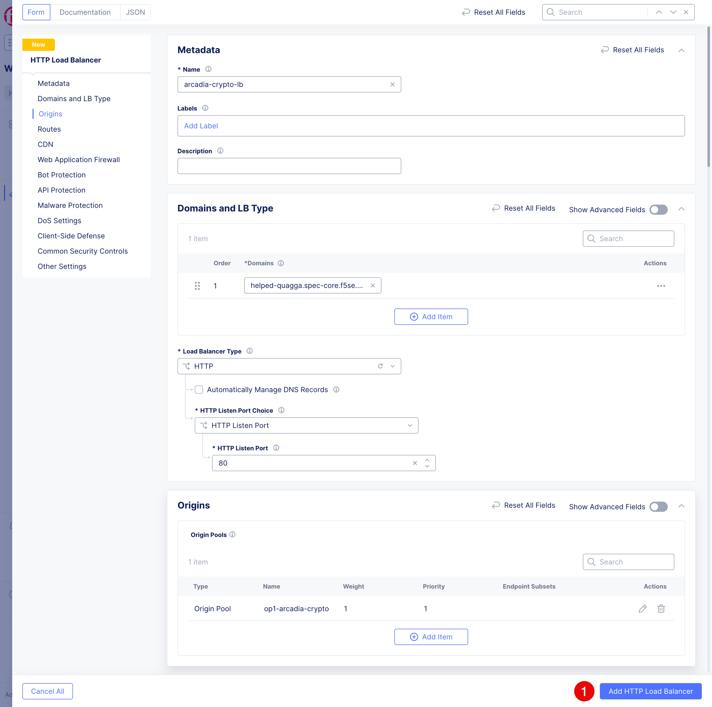
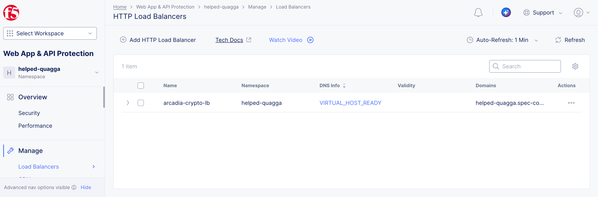

Publish and test the application
########################################

In this exercise, you will publish the Arcadia Crypto application with an F5 Distributed Cloud HTTP load balancer. The origin pool will distribute requests across its three origin servers by using the round-robin algorithm.

Create the HTTP load balancer
=============================

1. In the F5 Distributed Cloud Console, go to **Load Balancers (1)** -> **HTTP Load Balancers (2)**.

2. Click **Add HTTP Load Balancer (3)** and configure the following values:

   .. image:: ../pictures/lb-add.png
      :align: center

3. Fill in the following fields. Make sure to use your namespace in the **Domains** field to not interfere with other workshop participants. Click **Add Item** in the **Origin Pools** section
   .. table::
      :widths: auto

      ====================================    =========================================================
      Object                                  Value
      ====================================    =========================================================
      **Name**                                arcadia-crypto-lb
      **Domains**                             $$namespace$$.spec-core.f5se.com
      **Load Balancer Type**                  HTTP
      ====================================    =========================================================

   .. image:: ../pictures/lb-details-1.png
      :align: center

Add the origin pool
===================

1. In the appeared dialog select the **Origin Pool (1)** you created in the previous exercise: ``$$namespace$$/op1-arcadia-crypto``.

2. Click **Apply (2)**.

Click **Add Http Load Balancer (1)** to create the load balancer.

The added loadbalancer will look like this. Make sure the **DNS Info** is **VIRTUAL_HOST_READY**. Wait for DNS propagation if it is not.

Test round-robin distribution
=============================

1. Wait for the load balancer configuration and managed DNS record to become active.

2. Browse to :ext_link:`http://$$namespace$$.spec-core.f5se.com`.

3. Note the origin server name displayed in the page header and footer.

4. Refresh the page several times. Confirm that the header and footer rotate among:

   * **Arcadia Crypto Origin Pool 1**
   * **Arcadia Crypto Origin Pool 2**
   * **Arcadia Crypto Origin Pool 3**

.. note:: A browser or intermediary may reuse an existing connection. If the displayed origin does not change, perform additional refreshes or open the URL in a new private browsing window.

.. warning:: Some service providers retain recursive DNS responses for several minutes. If the domain does not resolve after the load balancer becomes active, try a resolver such as ``1.1.1.1`` or ``8.8.8.8``.

The application is now published to the internet but is not yet protected. In the next modules, you will configure a basic Web Application Firewall (WAF), enable IP Intelligence, and configure Malicious User Detection to help protect the application.