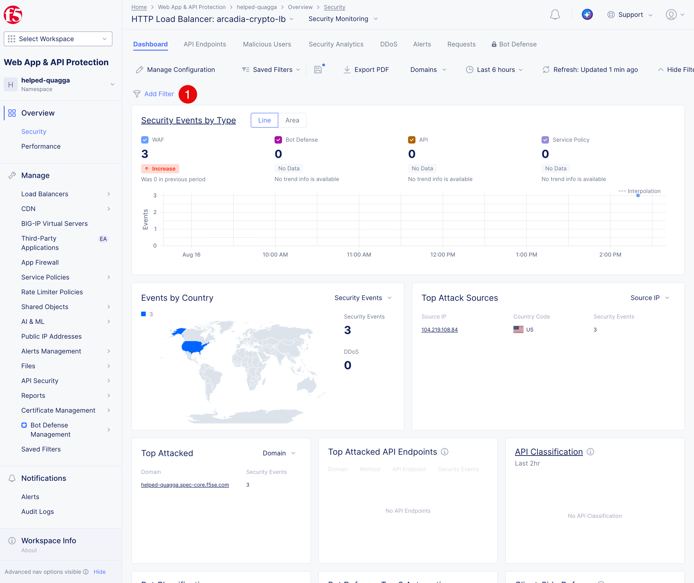
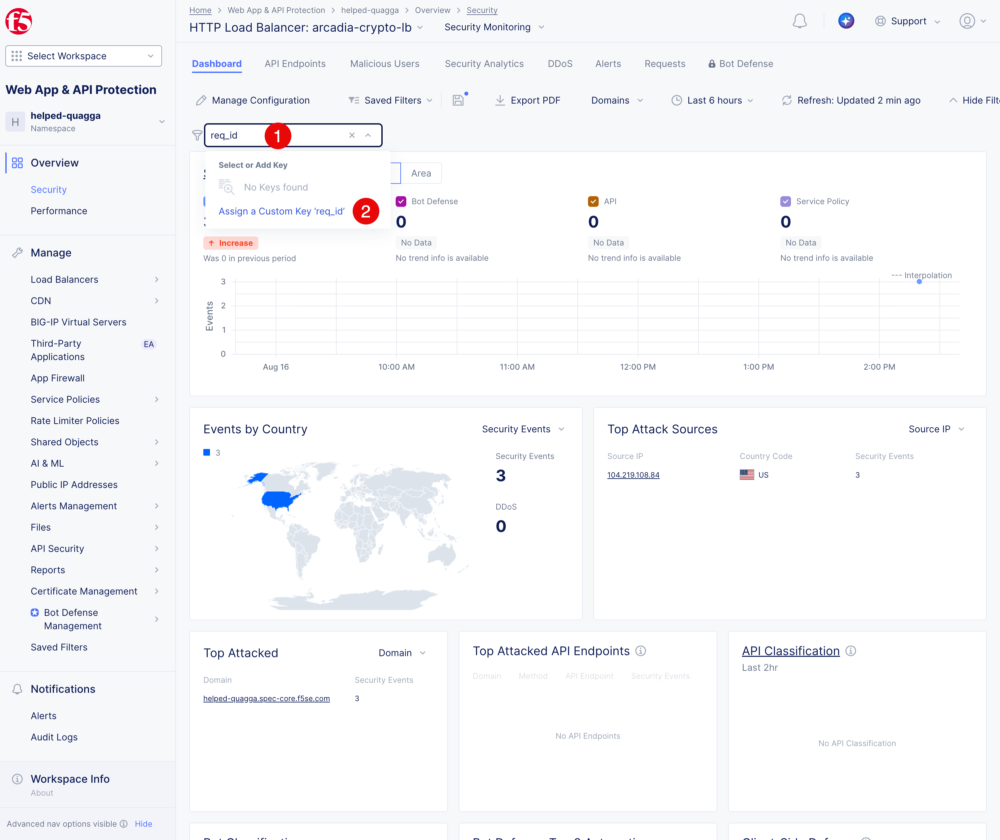
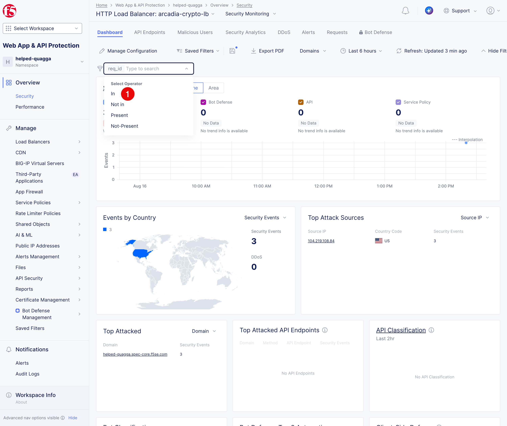
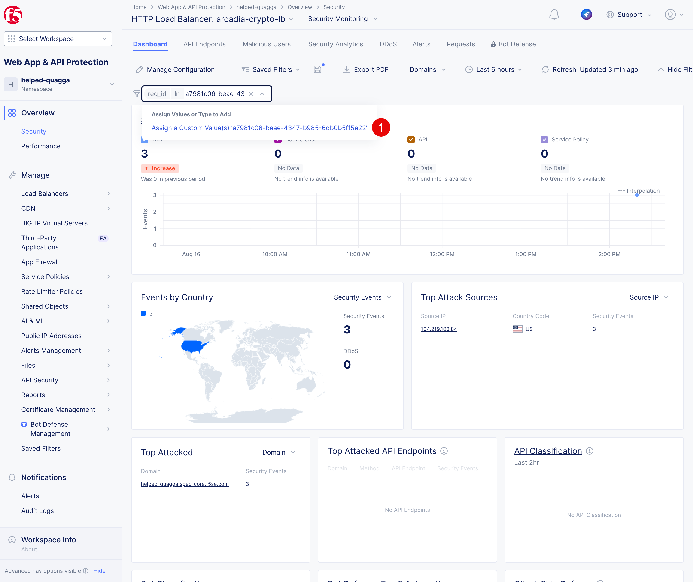
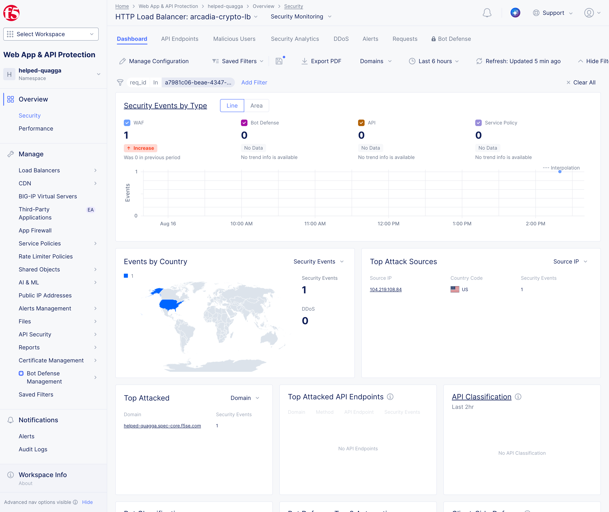

Test the firewall and review security events
############################################

XSS Attack
==========

1. First let's try and attack our application with an **XSS attack** using the bellow URL. The attack will be blocked and a **support ID** will be provided. Save the **support ID** as it will be used in the next step.

   :ext_link:`http://$$namespace$$.spec-core.f5se.com/?a=%3Cscript%3Ealert(%27xss%27)`

2. The request will be blocked by WAF:
   
   .. image:: ../pictures/waf-block.png
      :align: center

3. Copy the **support ID (1)** from the blocked request message. You will need it in the next step to filter the security events.

WAF Dashboard
=============  

1. Open the **Security** dashboard. Click **Web App & API Protection -> Overview -> Security (1)**
   
   .. image:: ../pictures/security-dashboard.png
      :align: center

2. Scoll down to tge **Delivery Resources (1)** section. Make sure that **HTTP LB (2)** is selected and click on the **arcadia-re-lb (3)** row.

   .. image:: ../pictures/security-dashboard-delivery-resources.png
      :align: center

3. You sill see the security events **Dashboard**

   .. image:: ../pictures/security-events.png
      :align: center

Filtering the security events
=============================
1. Click **Add Filter (1)**.  

2. Enter the ``req_id``as a filter field (1) and select Select **Assign a Custom Key (2)**:

3. In the appeared menu select **In (1)** operation:

4. Paste the copied **support ID** from the previous step into the **Value (1)** field and click **Assign a Custom Value(s) (2)**.

5. The security events will be filtered and you will see the blocked request with the **support ID** you used in the filter.
