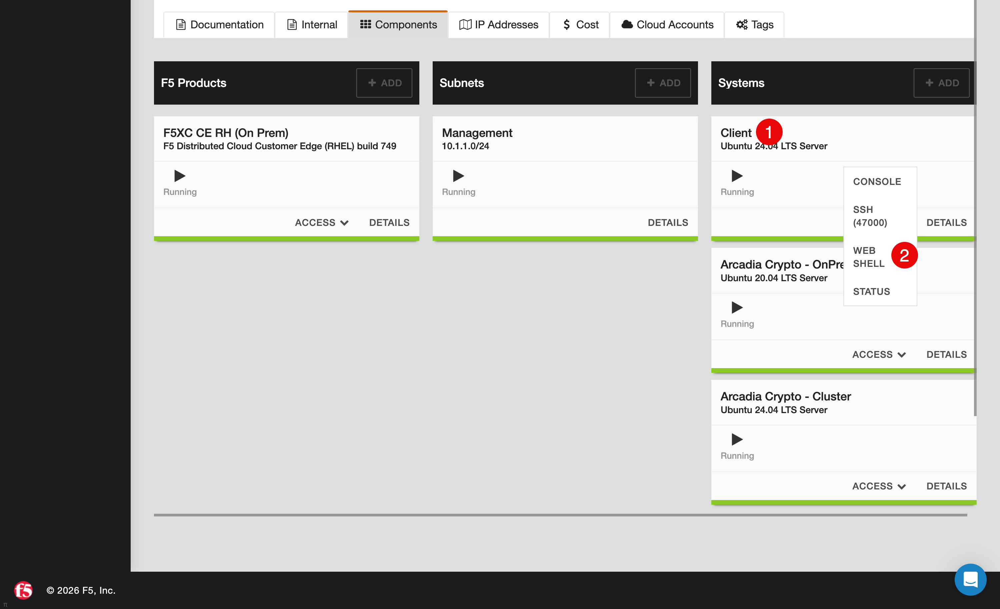

Test the Application Before Enabling the WAF Rules
##################################################

Before enabling the WAF rules in F5 Distributed Cloud (F5 XC), send test requests to establish a baseline for the application's behavior. Because the WAF rules are not yet enabled, the responses in this section come directly from the application.

In the UDF environment, locate the **Client (1)** component. Click **Access**, and then click **Web Shell (2)** to open a terminal.

Run the following commands:
1. Send a login request with valid credentials. The application is expected to accept the request.

   .. code-block:: none

      curl \
        -H "Content-Type: application/json;charset=UTF-8" \
        --data-raw '{"email":"satoshi@bitcoin.com","password":"bitcoin"}' \
        http://$$namespace$$.spec-core.f5se.com/v1/login

   The application returns a successful login response that includes an assigned JWT.

2. Send a login request with an invalid email value.

   .. code-block:: none

      curl \
        -H "Content-Type: application/json;charset=UTF-8" \
        --data-raw '{"email":"11223344","password":"bitcoin"}' \
        http://$$namespace$$.spec-core.f5se.com/v1/login

   The application returns a failed login response. F5 XC does not block this request because the WAF rules are not yet enabled.