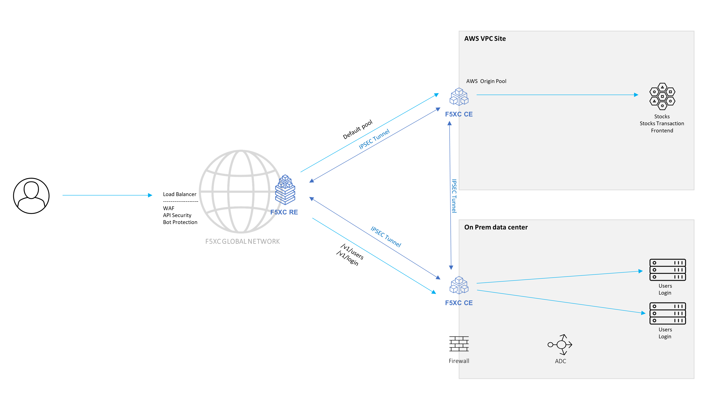

Migrate the application
#######################

The management decided to go with AWS and move the Stocks, Stocks Transaction and Frontend services.

The Users and Login services will need to remain onprem since they deal with user sensetive data and the regulation and the security team are not allowing moving them.

In this section, we will create the configuration which will be able to route to different endpoints and the relevant environment based on the application requirements.

**Hands-on exercises**

.. toctree::
   :maxdepth: 1
   :glob:

   [0-9][0-9]-*/[0-9][0-9]-*

