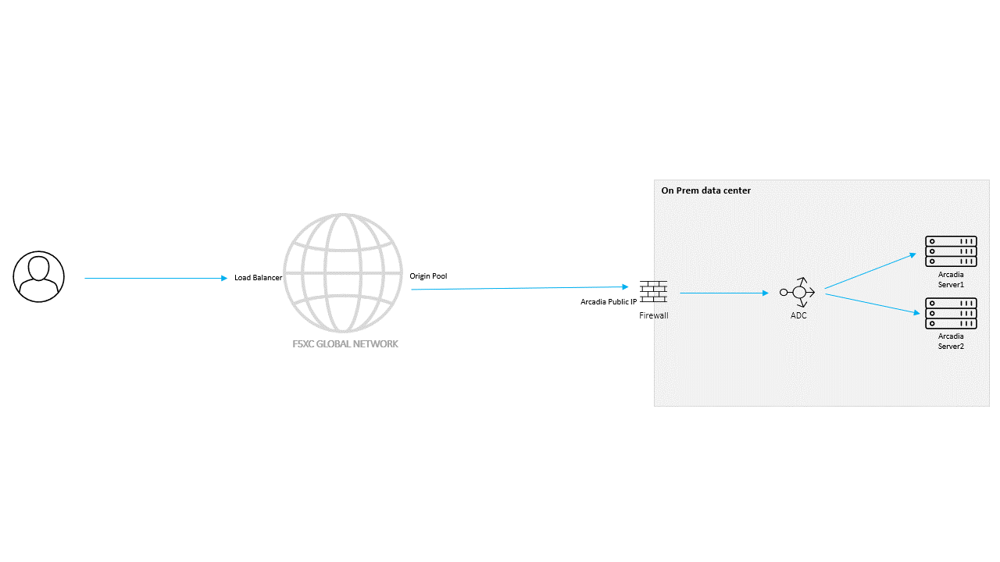

Multi-Cloud Networking
######################

Exercise Overview
====================
This section covers F5 Distributed Cloud Multi-Cloud Networking (MCN).

These exercises use the **Arcadia Crypto** application.

This modern application simulates a cryptocurrency trading platform where users can buy and sell cryptocurrencies.

The following components are used within the application:

* **Frontend** - serves non-dynamic content such as HTML, JavaScript, CSS, and images
* **Login** - handles user authentication and login functionality
* **Users** - manages all interactions with user data
* **Stocks** - connects to external resources to retrieve the latest cryptocurrency data and serves it to application clients
* **Stocks Transaction** - handles cryptocurrency purchases and sales, interacting with services such as Users and Stocks
* **Database** - stores all application data

The application is now distributed across multiple cloud environments. To cope with increased demand, the frontend is deployed in AWS, while the backend services are deployed in an on-premises Kubernetes cluster. The internal services in this cluster are not directly accessible from the Internet.

F5 Distributed Cloud Multi-Cloud Networking (MCN) connects these separate environments into a single application architecture while maintaining secure communication and consistent workflows. The UDF deployment includes an on-premises Customer Edge (CE), and an F5 Distributed Cloud Secure Mesh Site v2 is predeployed in the AWS environment.

In this section, you will:

* Explore the application frontend deployed in AWS
* Connect the AWS frontend to backend services in the on-premises Kubernetes cluster
* Use F5 Distributed Cloud MCN to provide secure connectivity between the separate application environments

Secure Mesh Sites
=================
The lab uses two F5 Distributed Cloud Customer Edge (CE) sites: one in AWS for the Arcadia frontend and one in the on-premises environment for the backend services. Each CE establishes encrypted connectivity to the F5 Global Network. Both sites must complete registration and provisioning before routes and application traffic can be exchanged between the environments.

1. In the F5 Distributed Cloud Console, open **Select Workspace (1)**, then select **Multi-Cloud Network Connect (2)**.

   .. image:: ./pictures/mcn-navigate.png
      :align: center

2. Verify that the ``smsv2-$$namespace$$`` on-premises CE site and the ``spec-core-aws-frontend`` AWS CE site both report **Online**. This status confirms that each CE has completed provisioning and established connectivity to the F5 Global Network. If either site is not online, wait for provisioning to complete, then click **Refresh**.

   .. image:: ./pictures/mcn-sms-list.png
      :align: center

.. note::
   On-premise CE start might take up to 20 minutes. If its longer than that, check the CE logs for errors.

**Workshop topics**

.. toctree::
   :maxdepth: 2
   :glob:

   [0-9][0-9]-*/[0-9][0-9]-*