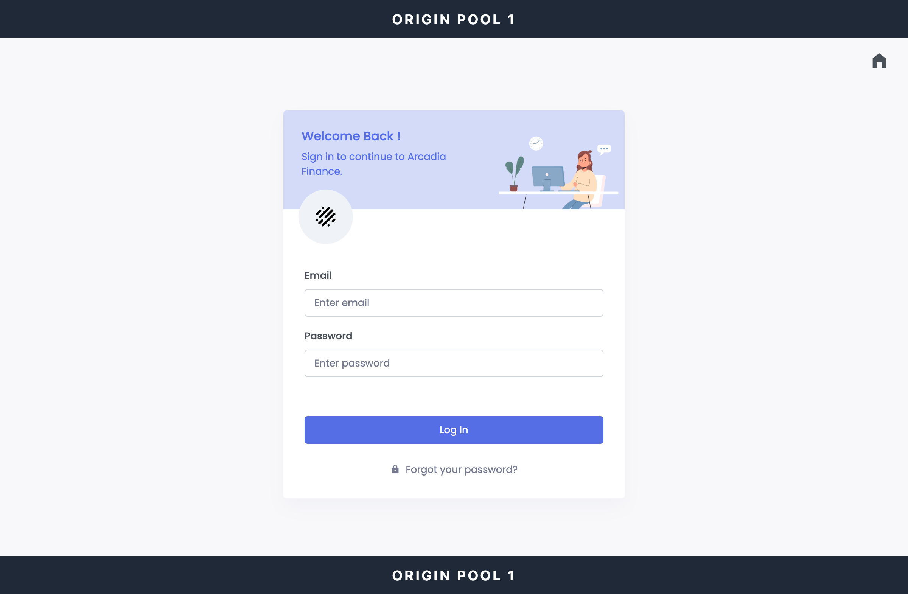

Create the Arcadia Crypto origin pools
#########################################

In this exercise, you will identify the three Arcadia Crypto application endpoints provided by UDF and create one F5 Distributed Cloud origin pool for each endpoint.

Discover the Arcadia Crypto endpoints
=====================================

1. In UDF, locate the component named **Arcadia Crypto - Cluster**.

2. Open the **Details** menu for the component. Under **Access Methods**, locate these three URLs:

   .. react:: DeploymentAccessMethods
      :deployment: Arcadia Crypto - Cluster
      :access-methods: Arcadia Crypto Origin Pool 1, Arcadia Crypto Origin Pool 2, Arcadia Crypto Origin Pool 3

3. Record each URL. You will use its hostname when you configure the corresponding origin pool.

.. image:: ../pictures/udf-arcadia-crypto-access-links.png
   :align: center

Verify the Arcadia Crypto endpoints
===================================

1. Open :deployment-access-method:`Arcadia Crypto - Cluster|Arcadia Crypto Origin Pool 1` in a new browser tab.

2. Confirm that **Arcadia Crypto Origin Pool 1** appears in the page header and footer.

3. Open :deployment-access-method:`Arcadia Crypto - Cluster|Arcadia Crypto Origin Pool 2` and confirm that **Arcadia Crypto Origin Pool 2** appears in the header and footer.

.. image:: ../pictures/arcadia-crypto-op2.png
   :align: center

4. Open :deployment-access-method:`Arcadia Crypto - Cluster|Arcadia Crypto Origin Pool 3` and confirm that **Arcadia Crypto Origin Pool 3** appears in the header and footer.

.. image:: ../pictures/arcadia-crypto-op3.png
   :align: center

Create three origin pools
=========================

Repeat the following procedure for each Arcadia Crypto endpoint.

1. In the F5 Distributed Cloud Console, go to **Web App & API Protection** -> **Load Balancers** -> **Origin Pools**.

2. Click **Add Origin Pool** and configure the pool using the values below. For **DNS Name**, enter only the hostname from the matching UDF URL; do not include ``https://`` or a path.

   .. table::
      :widths: auto

      ==============================    =========================================================
      Object                            Value
      ==============================    =========================================================
      **Name**                          arcadia-origin-pool-1, arcadia-origin-pool-2, or arcadia-origin-pool-3
      **Origin Server Type**            DNS Name
      **DNS Name**                      Hostname from the corresponding UDF access URL
      **Port**                          443
      **TLS**                           Enable
      **Origin Server Verification**    Skip Verification
      ==============================    =========================================================

3. Under **Origin Servers**, click **Add Item**, enter the matching DNS name, and click **Apply**.

4. Click **Save and Exit**.

5. Repeat these steps until all three origin pools exist.

.. Screenshot placeholder: completed origin pool configuration.

.. warning:: Skipping origin server certificate verification is appropriate for this workshop environment only. In production, validate the origin certificate with a trusted CA or a configured certificate.

Verify your configuration
=========================

Confirm that the following origin pools are listed in your namespace:

* ``arcadia-origin-pool-1``
* ``arcadia-origin-pool-2``
* ``arcadia-origin-pool-3``

In the next exercise, you will attach all three origin pools to one HTTP load balancer.